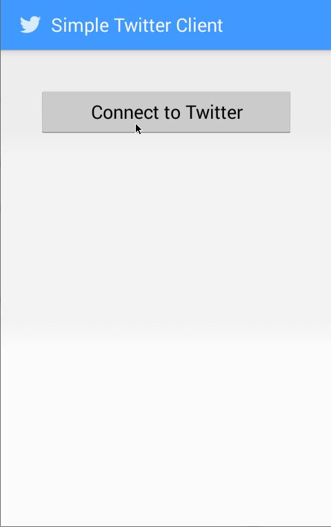

This is a Simple Twitter Client app.

Time spent: 6 hours 

Completed user stories:

* [x] Required: User can sign in to Twitter using OAuth login
* [x] Required: User can view the tweets from their home timeline
* [x] Required: User should be able to see the username, name, body and timestamp for each tweet
* [x] Required: User should be displayed the relative timestamp for a tweet "8m", "7h" 
* [x] Required: User can view more tweets as they scroll with infinite pagination
* [x] Required: User can click a “Compose� icon in the Action Bar on the top right
* [x] Required: User can then enter a new tweet and post this to twitter
* [x] Required: User is taken back to home timeline with new tweet visible in timeline

* [x] Optional: Links in tweets are clickable and will launch the web browser
* [x] Optional: User can see a counter with total number of characters left for tweet

Notes:

None

Walk-through of all user stories:

